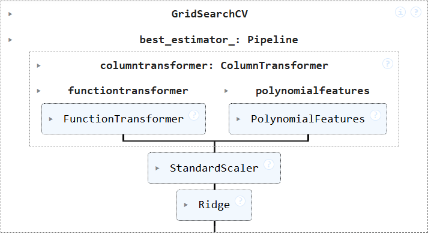

# Introduction

##### Topic

This page details my investigation of a portion of the **[Food.com Recipes and Interactions](https://www.kaggle.com/datasets/shuyangli94/food-com-recipes-and-user-interactions/data)** dataset. 
I'm attempting to answer the question:
> "What kinds of recipes get high reviews?". 

I hope my analysis will reveal ideas about what kinds of recipes get rated highly, which may help writers create better performing recipes, as well as readers to recognize biases in others' reviews.

##### Dataset Details

This project technically covers two datasets, described below

- The **recipes** dataset contains 83,782 rows and 12 columns. The dataset contains these relevant columns. 

| Column        | Type    | Description                               |
|:--------------|:--------|:------------------------------------------|
| minutes       | Integer | Minutes to prepare the recipe             |
| n_steps       | Integer | Number of steps in the recipe             |
| n_ingredients | Integer | Number of ingredients in the recipe       |
| step          | String  | Text for recipe steps, in an ordered list |

- The **reviews** dataset contains 731,927 rows and 5 columns. The dataset contains these relevant columns.

| Column | Type    | Description       |
|:-------|:--------|:------------------|
| rating | Integer | Rating given; 1-5 |

# Data Cleaning and Exploratory Data Analysis

##### Data Cleaning

To work on my main question, I needed to use the ratings dataset to get each recipe's average rating.
I combined the two datasets by left merging recipes and reviews. 
I then grouped the merged dataset by recipe, and I applied dataframe operations to create columns for the mean rating and rating
count. 

I am now working with a single dataframe that looks just like the **recipes** dataset, but with these new columns.

| Column       | Type  | Description                             |
|:-------------|:------|:----------------------------------------|
| review_count | Float | Total number of reviews for this recipe |
| avg_rating   | Float | Average of all ratings for this recipe  |

I plotted the distribution of ratings, and noticed sharp peaks at each of the whole number reviews. 
This clued me in that *many* recipes only had a handful of reviews. 
For my purposes, I want to analyse recipes that have been rated more fairly, so I elected to drop recipes that had less than 5 reviews.

I also decided to drop recipes that took longer than 520 minutes or had more than 40 steps, to avoid extreme outliers that could harm my results.

I later tested without these restrictions and got very poor results. 
It's safe to say that my analysis was only possible with these exclusions. 

This is the head of the cleaned dataset, with just the relevant columns. In total, it has 11,026 rows.

| minutes | n_steps | n_ingredients | steps                                         | review_count | avg_rating |
|---------|---------|---------------|-----------------------------------------------|--------------|------------|
| 75      | 6       | 6             | [\'in a bowl combine eggs , sugar...          | 6            | 4.33333    |
| 5       | 2       | 4             | [\'just mix together ouzo and orange juice... | 10           | 4.8        |
| 40      | 8       | 5             | [\'preheat oven to 350 degrees...             | 12           | 4.83333    |
| 5       | 6       | 6             | [\'in a blender combine coffee with...        | 8            | 5          |
| 50      | 12      | 13            | [\'to make the fish: place the fish...        | 5            | 4          |

##### Univariate Analysis

Embedded below is a plot of the distribution of average ratings for my cleaned dataset. This is a visualization of the data I want to predict when answering my question.

<iframe src="assets/ratings_distribution.html" width="800" height="600" frameborder="0"> </iframe>

Notice that the vast majority of the average reviews are clustered in the 4-5 range, which means most of my later predictions will likely be in this range. We can also still see some spikes at the whole numbers, which were even more pronounced before cleaning.

##### Bivariate Analysis

Embedded below is a scatter plot of average rating vs. number of steps in a recipe.

<iframe src="assets/rating_vs_steps.html" width="800" height="600" frameborder="0"> </iframe>

Notice that there is a notion of a quadratic shape in the plot. This will be relevant in my final predictive model.

##### Interesting Aggregates

Below is pivot table displaying average ratings for different cook time and ingredient count bins.

| time\ingredients |     0-4 |     5-9 |   10-14 |   15-19 |     20+ |
|:-----------------|--------:|--------:|--------:|--------:|--------:|
| under 15m        |  4.7842 | 4.75393 | 4.79244 | 4.76135 |   4.875 |   
| 15-30m           | 4.75857 | 4.73917 | 4.74547 | 4.70489 | 4.84335 |
| 30-60m           | 4.74094 | 4.71681 | 4.72456 | 4.71531 | 4.79394 |
| 1-2hrs           | 4.79623 | 4.70899 | 4.73261 | 4.78278 | 4.86265 |
| over 2hrs        | 4.65185 | 4.67085 | 4.64384 | 4.67743 | 4.70984 |

We can see some slight trends here, namely in the lower ratings for long recipes, and the higher ratings for more complex recipes. 
Note that the trends are indeed subtle, to help set up expectations for later results.

##### Imputation

To be cautious, all ratings with a value of **0** were replaced with **NaN**, and all rows with a **NaN** rating were excluded. 
However, it turns out that there were no **0** or **NaN** values in the portion of the recipes dataset that I used. 

# Framing a Prediction Problem

For my final prediction problem, my goal is

> To predict **ratings of recipes** by their steps, cook time, and ingredient count using regression.

##### Reasoning

I chose to predict ratings as my response variable, since I feel like it's the most relevant metric to people who are writing and reading recipes online.
In my experience, it's the first number I look at when I'm looking for a recipe, and if I published my own, I'd certainly care about how my recipe is rated by others.

I'm imagining that my results may be useful to someone looking to *publish* a recipe, so it makes sense that they will have the
steps, cook time, and ingredient count of their recipe available to use to predict their future rating.

##### Evaluation

To get a detailed overview, I will be evaluating my models with **Mean Squared Error**, **Mean Absolute Error**, and **R2 Score**. 
MSE is a standard metric to evaluate regression models, MAE is nice because it's in the same scale as the ratings, and
R2 is valuable since it tells us how much of the variance in the data is explained by my model. 
I'll also be analysing the model coefficients to glean any information. 

# Baseline Model

##### Model Details

I built a simple linear regression model to predict recipe ratings based on these features:
- minutes: Time to prepare the recipe
- n_ingredients: Number of ingredients in the recipe
- n_steps: Number of steps in the recipe

That is, exactly three quantitative features put into a linear regression. The only other step in the model was an initial standard scaling step, so that all model coefficients end up on the same scale for better comparison.

##### Performance

The model's performance metrics are:
- Mean Squared Error (MSE): $0.0972$
- Mean Absolute Error (MAE): $0.2290$
- R² Score: $0.0116$
- Coefficients: $[-0.03, -0.00, -0.00]$

Overall, this performance is actually quite **bad**. 
The MSE and MAE are pretty good, but given that almost all the recipes in the dataset were in the 4-5 star range, a constant model would do almost as well.
This is backed up by the abysmal R2 value, which indicates that the model explains only about $1.16$% of the variance in recipe ratings. 
Further, the coefficient values are close to zero, indicating that these features have minimal predictive power.

##### Thoughts

This may seem discouraging, however, it reveals some truth about the task at hand. 
It's intuitively quite *hard* to predict how well a recipe will do, especially just from its steps, ingredient count, and cook time.
In fact, it's difficult to predict a final average rating even after reading a whole recipe as a human; try it yourself! 
So while these results aren't amazing, there is still a lesson to be learned.

# Final Model

##### Model Details

Iterating on the baseline model, I made several key changes.

- I added a quantitative "step complexity" feature, defined by $\frac{\text{Total Length of Steps Text}}{\text{Number of Steps}}$. This was inspired by the idea that more detailed (and thus theoretically better) recipes will have more text per step. 
- Recalling the quadratic shape of the scatter plot mentioned above, I introduced 2nd degree polynomial features for the
  three quantitative features from the baseline model.
- I noticed a strong correlation between n_steps and n_ingredients, so I trained a ridge regression model instead of
  a linear regression model, which is known to work well for datasets with highly correlated features.
- I used a grid search to find the best regularization parameter, alpha, for the ridge regression.

Below is a visualization of my final model. 
The "step complexity" feature comes from the FunctionTransformer,
the polynomial features come from PolynomialFeatures, all features are standardized through the StandardScaler, and a Ridge regression is finally fit. 
All of this occurs within a GridSearchCV, which uses cross-validation to perform a search for the alpha that best minimizes MSE.

The grid search provided me with the alpha value $125.0$ out of the search options $[0.001, 0.01, 0.1, 1.0, 10.0, 100.0, 125.0, 150.0]$.

##### Performance

The final model's performance metrics are:

- Mean Squared Error: $0.0968$
- Mean Absolute Error: $0.2284$
- R² Score: $0.0150$
- Coefficients: $[ 0.01, -0.04, -0.01, -0.04, -0.00,    0.01,  0.00,    0.00,   -0.00,    0.03]$

Unsurprisingly, these results are also rather poor. 
There are marginal improvements in MSE and MAE, with a larger improvement in R².
I'm actually very happy with the R² improvement, since it means my new features do a significant $30$% better job at explaining the variance in the ratings. 
There are also many more non-zero coefficients. While they are all still very small in magnitude, they show that I have sucessfully engineered more features with at least some predictive power compared to the baseline.

##### Final Thoughts

I was originally disappointed in my model's performance.
In fact, I almost gave up and tried to ask and answer an entirely new question with the data.
However, I want to avoid the "file-drawer problem," a common issue where researchers tend not to share negative
findings, which gives the impression that all valuable research must have crazy results.
After thinking on it a while, I realized that even my poor results are an interesting accomplishment that I can be proud of. 
Learning that predicting recipe ratings is difficult with numeric features is a valuable insight, and being able to explain even $1.5$% of the variance of ratings with just them is quite a feat!
